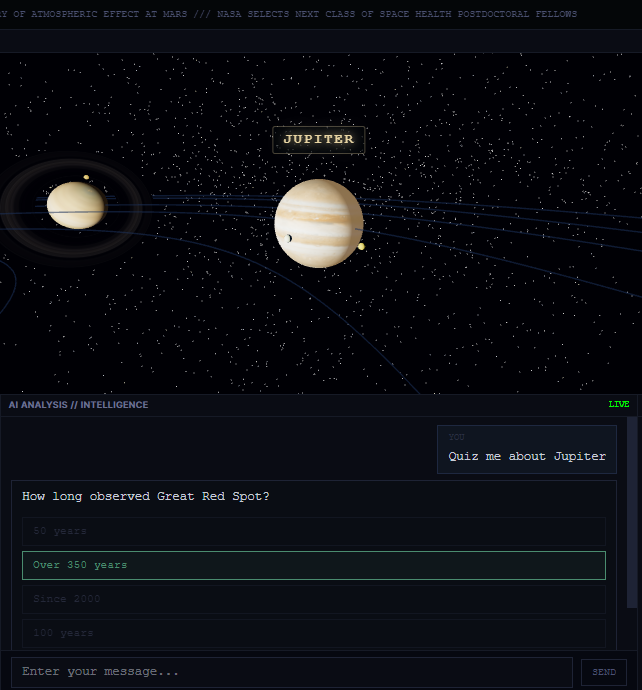

<h1 align="center">&nbsp; SPACE MONITOR v3.0</h1>

<p align="center">
  <strong>Agentic AI-Powered Interactive Space Simulator & Mission Control Dashboard<br>
  Real orbital mechanics · Live NASA telemetry · Conversational AI co-pilot</strong><br>
</p>

<p align="center">
  <a href="#-quick-start"></a>
  <a href="#-demos"></a>
  <a href="#-features"></a>
  <a href="#-test-results"></a>
</p>

<p align="center">
  
  
  
  
  
  
  
</p>

**Live app:** [agentic-ai-and-nlp-driven-space-sim.vercel.app](https://agentic-ai-and-nlp-driven-space-sim.vercel.app/)

<p align="center">
  
</p>

---

## 📰 What's New

> Real orbital mechanics, 16 moons, 14 live NASA panels — and an AI co-pilot that can navigate, explain, and quiz.

- **2026-05** 🪐 **Elliptic orbits & 16 moons** — Kepler equation solver for all 8 planets, plus Earth's Moon, 4 Galilean moons, Titan, Mimas, Enceladus, 5 Uranian moons, and Triton. Axial tilt rendering for every body.
- **2026-05** 🤖 **Agentic AI tool-use** — `get_planet_data`, `get_space_news`, `get_orbital_position`, `get_upcoming_launches` — the AI can fetch live data and respond with real context.
- **2026-05** 🧠 **Curriculum system** — 3 levels × 3 lessons each (9 total), progressive unlocking, per-session tracking with quiz completion.
- **2026-05** 📡 **7 real NASA API panels** — DSN Now, Exoplanet Archive, JPL Horizons (Voyager), APOD, Mars Weather (InSight), Solar Flares (NOAA SWPC), Mars Rover (Mars 2020 raw images). All simulated panels removed.
- **2026-04** 🌐 **Ephemeris via local math** — Replaced 8 slow JPL Horizons calls with instant client-side orbital element computation.
- **2026-04** 🧪 **Test suite** — 17 vitest (orbital math) + 52 pytest (agent routing, memory, curriculum).

<details>
<summary>Earlier updates</summary>

- **2026-04** 🎯 Intent classification in one LLM call with keyword fallback. Quiz bank covering 11 bodies.
- **2026-04** 🛰️ Fixed Voyager & Horizons date bug (`START_TIME == STOP_TIME`). NOAA SWPC replaces broken NASA DONKI.
- **2026-04** 🔧 1,271 lines of dead code removed. `"strict": true` in tsconfig. Server-side memory removed → re-added for agentic AI.

</details>

---

## 🤔 Why Space Monitor?

Space Monitor turns *raw space data into an immersive human + AI command center*.

| **Problem** | **Space Monitor's Fix** |
|-------------|------------------------|
| 🗺️ "Space data is scattered across 20+ websites" | 14 live panels pulling from NASA, NOAA, JPL — all in one grid |
| 🧑‍🚀 "Learning astronomy is dry" | Interactive 3D + AI co-pilot + adaptive quizzes — play, ask, learn |
| 🤖 "AI agents can't see what they're talking about" | Camera fly-in on planet names, live orbital math, visual context |
| 🧪 "Orbital mechanics demos are toy simulations" | Real eccentricities, Kepler solver, JPL-validated mean longitudes |
| 📊 "Teaching space is slides + static images" | Live ISS tracker, real solar flares, today's APOD, actual exoplanets |

---

## 🚀 Quick Start

### Prerequisites

- **Node.js** ≥ 18.x
- **Python** ≥ 3.9
- **NVIDIA API Key** — [Get one free](https://build.nvidia.com)
- **NASA API Key** *(optional)* — [Get one free](https://api.nasa.gov)

### 1. Clone

```bash
git clone https://github.com/HariNayan/Agentic-Ai-and-NLP-Driven-Space-Simulator.git
cd Agentic-Ai-and-NLP-Driven-Space-Simulator
```

### 2. Backend

```bash
cd backend
python -m venv venv
# Windows: venv\Scripts\activate  |  macOS/Linux: source venv/bin/activate
pip install -r requirements.txt
```

Create `backend/.env`:

```env
NVIDIA_API_KEY=nvapi-your-key-here
MODEL=minimax-m2.7
```

Start:

```bash
uvicorn main:app --reload --host 0.0.0.0 --port 8000
```

### 3. Frontend

```bash
cd frontend
npm install
```

Create `frontend/.env.local`:

```env
NEXT_PUBLIC_NASA_API_KEY=your-nasa-api-key-here
```

Start:

```bash
npm run dev      # dev server at localhost:3000
# or
npm run build && npm run start   # production
```

### 4. Open the Dashboard

Navigate to **http://localhost:3000** — the 3D solar system loads instantly. Ask the AI "Take me to Jupiter" or "Quiz me about Saturn".

---

## 🎬 Demos

> Videos and screenshots coming soon. Drop your media in `assets/` and update the paths below.

### 🪐 3D Solar System with 16 Moons

<p align="center">
  
</p>

An interactive Three.js scene with elliptic orbits (real eccentricities), axial tilt, textured planets, Saturn's rings, cloud layers on Earth, and 16 orbiting moons — all driven by a Kepler equation solver.

### 🤖 AI Co-Pilot — Navigate, Explain, Quiz

<p align="center">
  
</p>

A conversational AI assistant that understands three intents:
- **`navigate`** — "Take me to Mars" → camera flies to Mars, info panel opens
- **`explain`** — "Why is Venus hotter than Mercury?" → streaming SSE explanation
- **`quiz`** — "Quiz me about Jupiter" → AI-generated multiple-choice question

### 📡 14 Live NASA Data Panels

<p align="center">
  
</p>

Real-time telemetry from 8 NASA/NOAA/JPL APIs + 6 computed panels — ISS position, exoplanet catalog, solar flare activity, Voyager distance, Deep Space Network dishes, Mars weather, APOD, and more.

### 🧠 Adaptive Curriculum

<p align="center">
  
</p>

9 progressive lessons across 3 levels (Beginner → Intermediate → Advanced), unlocked by completing quizzes. Session-level persistence tracks individual progress.

---

## ✨ Features

### 🪐 3D Solar System Engine

| Capability | Detail |
|-----------|--------|
| **Planets** | 8 textured bodies with accurate relative sizing |
| **Orbits** | Keplerian elliptic orbits with real eccentricities (0.0068–0.2056) |
| **Moons** | 16 moons with independent orbital motion |
| **Axial tilt** | Per-body axial rotation (Uranus: 98°, Earth: 23.4°) |
| **Saturn rings** | Semi-transparent ring system with gap |
| **Cloud layers** | Rotating cloud texture on Earth |
| **Sun** | Pulsating emissive glow + procedural starfield (12,800+ stars) |
| **Camera** | Orbit/zoom controls + smooth fly-to on AI navigation |
| **Click** | Click any planet or moon → floating name label |

### 🤖 Agentic AI System

| Feature | Detail |
|---------|--------|
| **Intent classification** | One LLM call classifies: navigate / explain / quiz |
| **Streaming responses** | Server-Sent Events for real-time token-by-token output |
| **5-model fallback chain** | MiniMax → Llama → Mistral → Gemma → Phi |
| **Tool-use** | 4 tools: planet data, space news, orbital position, launches |
| **Conversation memory** | 10-turn sliding window, per-session isolation |
| **Quiz generation** | LLM-generated MCQs + static bank fallback (11 bodies) |
| **Curriculum** | 9 progressive lessons, auto-unlock, per-session tracking |
| **Navigation fallback** | Keyword-based when LLM is rate-limited |

### 📡 Live Data Panels (14)

| Panel | Data Source | Type |
|-------|------------|------|
| **ISS Tracker** | Open Notify API | 10s poll |
| **Space News** | Spaceflight News API v4 | 5min poll |
| **NEO Asteroids** | NASA NeoWs API | 10min poll |
| **Upcoming Launches** | The Space Devs LL2 API | 10min poll |
| **Solar Flares** | NOAA SWPC real-time | On load |
| **Mars Perseverance** | NASA Mars 2020 Raw Image API | On load |
| **Deep Space Network** | NASA DSN Now API | On load |
| **Exoplanets** | NASA Exoplanet Archive TAP | On load |
| **Voyager 1 & 2** | JPL Horizons distance proxy | On load |
| **Mars Weather** | NASA InSight weather API | On load |
| **APOD** | NASA Astronomy Picture of the Day | On load |
| **Ephemeris** | Client-side orbital math | Real-time |
| **Planet Info** | Curated encyclopedia (9 bodies) | On selection |
| **News Ticker** | Spaceflight News API headlines | 30s scroll |

### 🎨 UI/UX Design

- **6-column mission control grid** — maximum information density
- **Monospace typography** — Courier New throughout
- **Dark navy + gold accent** palette — `#060810` base, `#e8d5a3` highlights
- **Zero border-radius** — sharp, utilitarian command-center feel
- **Custom thin scrollbars** — themed to match the dark UI

---

<table>
<tr>
<td width="33%">

### 🚀 STEM Outreach & Workshops

<p align="center"></p>

*Screenshot: The full browser window — 3D scene, chat, and panels visible at once*

A ready-to-run demo for science fairs and coding camps:
- Open the dashboard and start exploring — no account needed
- Ask the AI anything: "Why is the sky blue?", "Show me Neptune"
- Demonstrates real-time APIs, 3D graphics, and AI in one project

</td>
<td width="33%">

### 🛰️ Space Enthusiasts

<p align="center"></p>

A live mission control for anyone who follows space:
- Today's APOD as your dashboard backdrop
- Real solar flare alerts from NOAA SWPC
- Perseverance rover's latest raw images
- DSN dish status — see which spacecraft NASA is talking to

</td>
<td width="33%">

### 🧪 AI Agent / LLM Integration Demo

<p align="center"></p>

Show how AI agents interact with real tools and data:
- Conversational co-pilot with tool-use (planet data, launches, news)
- Streaming SSE responses with multi-model fallback
- Camera fly-to from natural language commands
- Session memory for contextual multi-turn conversations

</td>
</tr>
<tr>
<td width="50%">

### 🎓 Education & Learning

<p align="center"></p>

*Screenshot: AI explaining a planet with info panel open — type "Tell me about Saturn"*

Interactive 3D + AI tutor makes astronomy tangible. Students can:
- Fly to any planet and read real NASA telemetry
- Ask "Why is Uranus blue?" and get a streaming explanation
- Take progressive quizzes that unlock harder topics
- Watch ISS and Voyager positions update in real time

</td>
<td width="50%">

### 🎮 Gamified Learning

<p align="center"></p>

*Screenshot: Quiz visible in ChatPanel — question, options, and answer feedback*

Turn astronomy into an interactive experience:
- Earn quiz completions to unlock harder curriculum levels
- Explore planets in 3D instead of reading static charts
- Compose prompts like "Quiz me about Saturn" for instant challenges

</td>
</tr>
</table>

---

## 🏛️ Architecture

```
┌─────────────────────────────────────────────────────────────┐
│                     BROWSER (Port 3000)                     │
│                                                             │
│  ┌──────────────┐  ┌──────────────┐  ┌──────────────────┐  │
│  │  3D Scene     │  │  AI Chat     │  │  Data Panels     │  │
│  │  (Three.js)   │  │  (SSE Stream)│  │  (REST + Fetch)  │  │
│  └──────┬───────┘  └──────┬───────┘  └────────┬─────────┘  │
│         │                 │                    │            │
│  ┌──────┴─────────────────┴────────────────────┴─────────┐  │
│  │              Zustand Store (spaceStore.ts)             │  │
│  │  • chatHistory    • currentCameraTarget                │  │
│  │  • isAiProcessing • showInfoPanel • lastCameraAction   │  │
│  └───────────────────────────┬───────────────────────────┘  │
│                              │                              │
│  ┌───────────────────────────┴───────────────────────────┐  │
│  │           Next.js API Routes (Server-Side)            │  │
│  │  /api/iss          → Open Notify                      │  │
│  │  /api/nasa-horizons → JPL Horizons                    │  │
│  │  /api/nasa          → Generic NASA proxy              │  │
│  │  /api/dsn           → NASA DSN Now                    │  │
│  │  /api/exoplanets    → NASA Exoplanet Archive          │  │
│  │  /api/mars-rover    → Mars 2020 Raw Image API         │  │
│  │  /api/solar-flares  → NOAA SWPC                       │  │
│  │  /api/voyager       → JPL Horizons Voyager            │  │
│  └───────────────────────────────────────────────────────┘  │
└──────────────────────────────┬──────────────────────────────┘
                               │
                    ┌──────────┴──────────┐
                    │  FastAPI (Port 8000) │
                    │                     │
                    │  POST /api/chat     │
                    │  ┌───────────────┐  │
                    │  │ Orchestrator  │  │
                    │  │    Agent      │  │
                    │  └───┬───┬───┬───┘  │
                    │      │   │   │      │
                    │   nav quiz explain  │
                    │      │   │   │      │
                    │  ┌───┴───┴───┴───┐  │
                     │  │  NVIDIA API   │  │
                    │  │  (5 models)   │  │
                    │  └───────────────┘  │
                    │  ConversationMem   │
                    │  Curriculum        │
                    └─────────────────────┘
```

### State Management Strategy

The app uses **atomic Zustand selectors** to prevent the WebGL 3D scene from re-rendering when unrelated state changes:

```typescript
const target = useSpaceStore((state) => state.currentCameraTarget);  // SceneContent
const chat   = useSpaceStore((state) => state.chatHistory);          // ChatPanel
const show   = useSpaceStore((state) => state.showInfoPanel);        // PlanetInfoOverlay
```

The `SceneContent` component runs **vanilla Three.js** (not React Three Fiber) — planet positions, camera movement, and animations are all driven by `requestAnimationFrame` with mutable refs, completely decoupled from React's reconciliation cycle.

---

## ⚡ Key Design Decisions

| Decision | Rationale |
|----------|-----------|
| **Vanilla Three.js over R3F** | Full decoupling from React render cycle — 60fps even during React re-renders |
| **Server-side memory (re-added)** | Session persistence needed for curriculum progression and contextual AI |
| **Classify intent → one LLM call** | With keyword fallback for rate-limit resilience |
| **Local orbital math over JPL live** | Instant loading — 8 JPL queries replaced by client-side Kepler solver |
| **NOAA SWPC over NASA DONKI** | NASA DONKI endpoint returning 503; SWPC is reliable and real-time |
| **JPL START_TIME < STOP_TIME** | Horizons rejects equal start/stop; +1 minute offset avoids "Bad dates" error |

---

## 🖥️ Tech Stack

### Frontend

| Technology | Version | Purpose |
|-----------|---------|---------|
| **Next.js** | 16.2.3 | React framework with App Router |
| **React** | 19.2.5 | UI component library |
| **Three.js** | 0.183.2 | 3D WebGL rendering |
| **Zustand** | 5.0.0 | Atomic state management |
| **TypeScript** | 5.4.5 | Type safety (`strict: true`) |
| **Tailwind CSS** | 4.2.2 | Utility CSS (minimal) |
| **Vitest** | 4.1.6 | Frontend test runner |

### Backend

| Technology | Purpose |
|-----------|---------|
| **FastAPI** | Async Python web framework |
| **Uvicorn** | ASGI server with hot reload |
| **httpx** | Async HTTP client for NVIDIA API & NASA APIs |
| **Pydantic** | Request/response validation |
| **python-dotenv** | Environment variable management |
| **pytest** | Backend test runner (52 tests) |

### External APIs

| API | Usage |
|-----|-------|
| **NVIDIA API** | LLM inference (MiniMax, Llama, Mistral, Gemma, Phi) |
| **NASA JPL Horizons** | Real planetary orbital positions |
| **NASA NeoWs** | Near-Earth Object tracking |
| **NOAA SWPC** | Solar flare events |
| **NASA Mars 2020 Raw Image API** | Perseverance rover latest images |
| **NASA Exoplanet Archive** | Exoplanet data via TAP query |
| **NASA DSN Now** | Deep Space Network dish telemetry |
| **NASA APOD** | Astronomy Picture of the Day |
| **NASA InSight Weather** | Mars weather data |
| **Open Notify** | ISS real-time position |
| **Spaceflight News API** | Space news articles |
| **The Space Devs** | Upcoming rocket launches |

---

## 🧪 Test Results

| Suite | Tests | Scope |
|-------|-------|-------|
| **Frontend: orbital math** (vitest) | 17 | `solveKepler`, `ellipticalPosition`, `getCurrentAngle`, data integrity |
| **Backend: agent routing** (pytest) | 52 | Intent classification, memory, curriculum, tool execution, quiz fallback, navigation |

```
========================== Frontend (vitest) ==========================
 src/utils/orbitalMath.test.ts
   ✔ solveKepler — circular, eccentric, high-e, convergence
   ✔ ellipticalPosition — perihelion offset, planet bounds
   ✔ getCurrentAngle — range, determinism, unknown bodies
   ✔ PLANET_DATA / MOON_DATA integrity — 8 planets, orbit>size
 17 passed

========================== Backend (pytest) ===========================
 tests/test_agents.py
   ✔ classify_intent (11) — navigate/quiz/explain, keywords, fallback
   ✔ safe_json_parse (7) — code fences, invalid JSON, whitespace
   ✔ ConversationMemory (11) — add/get/clear/sliding-window/format
   ✔ Curriculum (7) — level unlock, lesson progression
   ✔ execute_tool (6) — planet data, orbital position, unknown tool
   ✔ determine_navigation_fallback (7) — keywords, pronouns, actions
   ✔ quiz_agent (3) — LLM fallback, bank fallback, completeness
   ✔ PLANET_DB integrity (1) — required fields
 52 passed
──────────────────────────────────────────────────────────────────────
 TOTAL: 69 passed ✅
```

---

## 📁 Project Structure

```
Space/
├── README.md
├── SETUP.md
├── .gitignore
│
├── backend/                          # FastAPI Python backend
│   ├── .env                          # OPENROUTER_API_KEY, MODEL
│   ├── main.py                       # FastAPI app, routes, CORS, SSE streaming
│   ├── agents.py                     # AI agent system (orchestrator, tools, memory, curriculum, quiz)
│   ├── schemas.py                    # Pydantic models
│   ├── requirements.txt              # Python dependencies
│   ├── pytest.ini                    # Pytest config
│   └── tests/
│       └── test_agents.py            # 52 agent routing tests
│
├── frontend/                         # Next.js 16 frontend
│   ├── .env.local                    # NASA API key
│   ├── package.json
│   ├── tsconfig.json                 # strict: true
│   ├── vitest.config.ts
│   │
│   ├── public/textures/              # Planet texture images
│   │   ├── sun.jpg, mercury.jpg, venus.jpg, earth.jpg, mars.jpg
│   │   ├── jupiter.jpg, saturn.jpg, saturn_ring.png
│   │   ├── uranus.jpg, neptune.jpg, earth_clouds.jpg
│   │
│   └── src/
│       ├── app/
│       │   ├── layout.tsx
│       │   ├── page.tsx              # Main dashboard (6-column mission control grid)
│       │   ├── globals.css
│       │   └── api/                  # 8 server-side API proxy routes
│       │       ├── iss/              → Open Notify
│       │       ├── nasa-horizons/    → JPL Horizons
│       │       ├── nasa/             → Generic NASA proxy
│       │       ├── dsn/              → NASA DSN Now
│       │       ├── exoplanets/       → NASA Exoplanet Archive
│       │       ├── mars-rover/       → Mars 2020 Raw Images
│       │       ├── solar-flares/     → NOAA SWPC
│       │       └── voyager/          → JPL Horizons Voyager
│       │
│       ├── components/
│       │   ├── SceneContent.tsx      # 3D solar system (vanilla Three.js)
│       │   ├── ISSTracker.tsx
│       │   ├── NewsPanel.tsx
│       │   ├── AsteroidPanel.tsx
│       │   ├── LaunchPanel.tsx
│       │   ├── UI/
│       │   │   ├── ChatPanel.tsx     # AI chat with SSE streaming
│       │   │   └── PlanetInfoPanel.tsx
│       │   └── panels/
│       │       ├── SolarFlaresPanel.tsx
│       │       ├── MarsRoverPanel.tsx
│       │       ├── DeepSpaceNetworkPanel.tsx
│       │       ├── ExoplanetPanel.tsx
│       │       ├── VoyagerPanel.tsx
│       │       ├── MarsWeatherPanel.tsx
│       │       ├── APODPanel.tsx
│       │       └── EphemerisPanel.tsx
│       │
│       ├── store/
│       │   └── spaceStore.ts         # Zustand global state
│       │
│       └── utils/
│           ├── orbitalMath.ts        # Kepler solver, orbital elements, data
│           └── orbitalMath.test.ts   # 17 vitest orbital math tests
```

---

## 🔧 Environment Variables

### Backend (`backend/.env`)

| Variable | Required | Description |
|----------|----------|-------------|
| `NVIDIA_API_KEY` | ✅ | NVIDIA API key for LLM inference |
| `MODEL` | ❌ | Primary model (default: `minimax-m2.7`) |

### Frontend (`frontend/.env.local`)

| Variable | Required | Description |
|----------|----------|-------------|
| `NEXT_PUBLIC_NASA_API_KEY` | ❌ | NASA API key (falls back to `DEMO_KEY`) |

---

## 🤖 AI Agent Architecture

The backend implements a **multi-agent system** with specialized roles:

### 1. Orchestrator Agent
Classifies user intent into one of three categories using a single LLM call:
- **`navigate`** → returns JSON target → camera flies there
- **`explain`** → triggers SSE streaming explanation
- **`quiz`** → generates MCQ via quiz agent

### 2. Explainer Agent (Streaming)
Two difficulty modes via different system prompts:
- **Beginner** — Simple language, fun analogies, ≤120 words
- **Advanced** — Technical terminology, real measurements, ≤150 words

### 3. Quiz Agent
LLM-generated MCQs with static bank fallback. Bank covers 11 bodies (Sun, Moon, 8 planets).

### 4. Tool-Using Agent
When activated, the AI can call tools via `TOOL_CALL:` syntax:
- `get_planet_data(planet)` — physical properties
- `get_space_news()` — latest headlines
- `get_orbital_position(planet)` — current mean longitude
- `get_upcoming_launches()` — rocket schedule

### Model Fallback Chain
```
minimax-m2.7
  → meta/llama-3.1-8b-instruct
    → mistralai/mistral-7b-instruct-v0.3
      → google/gemma-2-9b-it
        → microsoft/phi-3-mini-128k-instruct
```

---

## ⚡ Performance Optimizations

| Optimization | Impact |
|-------------|--------|
| **Vanilla Three.js** (not R3F) | 3D fully decoupled from React reconciliation |
| **Atomic Zustand selectors** | Components re-render only on their slice change |
| **`React.memo` on all panels** | Prevents cascading re-renders |
| **Dynamic import with `ssr: false`** | Three.js loaded client-side only |
| **Mutable refs for animation state** | Camera, planets, angles stored in refs, not state |
| **`requestAnimationFrame` loop** | Animation independent of React render cycle |
| **Pixel ratio capped at 2** | Prevents excessive GPU load on HiDPI |
| **Local orbital math** | Instant computation, zero network calls |
| **Server-side API proxies** | CORS avoidance + reduced client requests |

---

## 🎨 Design System

### Color Palette

| Token | Hex | Usage |
|-------|-----|-------|
| `--bg` | `#060810` | Page background |
| `--panel` | `#0a0c14` | Panel backgrounds |
| `--border` | `#161a26` | Primary borders |
| `--border2` | `#1e2335` | Secondary borders |
| `--text` | `#c8ccd8` | Body text |
| `--muted` | `#4a5070` | Muted/secondary text |
| `--accent` | `#e8d5a3` | Gold accent (headers, highlights) |
| `--blue` | `#6a9fd8` | Data values, links |
| `--green` | `#4a8c6f` | Status: online/active |
| `--red` | `#c0473a` | Status: hazardous/error |

### Typography
- **Primary:** `'Courier New', monospace` — all text
- **Sizes:** 7px (labels) → 10px (body) → 16px (planet names)
- **Letter spacing:** 0.05em–0.14em for uppercase labels

---

## 📄 License

This project is for educational and personal use only. No license is granted for commercial use.

---

## 🙏 Acknowledgments

- **[NASA JPL Horizons](https://ssd.jpl.nasa.gov/horizons/)** — Real planetary ephemeris data
- **[NASA Open APIs](https://api.nasa.gov/)** — NeoWs, Mars Photos, APOD, InSight
- **[NOAA SWPC](https://www.swpc.noaa.gov/)** — Real-time solar flare data
- **[Open Notify](http://open-notify.org/)** — ISS position tracking
- **[Spaceflight News API](https://api.spaceflightnewsapi.net/)** — Space news aggregation
- **[The Space Devs](https://thespacedevs.com/)** — Launch schedule data
- **[NVIDIA API](https://build.nvidia.com/)** — LLM inference via NVIDIA-hosted models
- **[Three.js](https://threejs.org/)** — WebGL 3D rendering engine
- **[Solar System Scope](https://www.solarsystemscope.com/textures/)** — Planet textures

---

<p align="center">
  <strong>Built for space exploration 🛰️ — one orbit at a time</strong>
</p>
